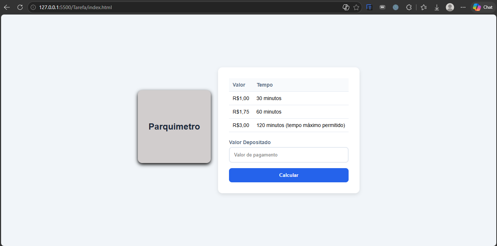

# 🚗 Projeto Parquímetro

Um mini projeto prático de parquímetro para simular o cálculo de tempo de estacionamento e troco com base no valor depositado. Este projeto faz parte da minha jornada de aprendizado em desenvolvimento de software.

---

## 📸 Demonstração

Aqui está o visual atual da aplicação:

<!-- ESPAÇO PARA A IMAGEM DA PÁGINA -->



---

## 🚀 Tecnologias Utilizadas

* **HTML5:** Estruturação semântica da página.
* **CSS3:** Estilização moderna, layout centralizado com Flexbox e feedback visual nos botões.
* **JavaScript:** Lógica para processar o valor inserido, calcular o tempo equivalente e exibir o troco.

---

## 🧠 Meu Aprendizado & Evolução

Este projeto reflete a consolidação dos meus estudos em lógica de programação e interface web. Na minha trilha de aprendizado, já passei por conceitos importantes como:

* **Lógica de Programação Básica:** Manipulação do DOM, funções, variáveis e condicionais (`if/else`).
* **POO (Programação Orientada a Objetos):** Compreensão de classes, objetos, pilares da orientação a objetos e como estruturar códigos mais robustos e reutilizáveis.
* **Interface e UX:** Evolução do design bruto para telas mais limpas, focando na experiência do usuário ao interagir com formulários e tabelas.

---

## 🛠️ Como Executar o Projeto

1. Faça o clone deste repositório:
```bash
   git clone [https://github.com/Feizty/Parquimetro.git](https://github.com/Feizty/Parquimetro.git)
